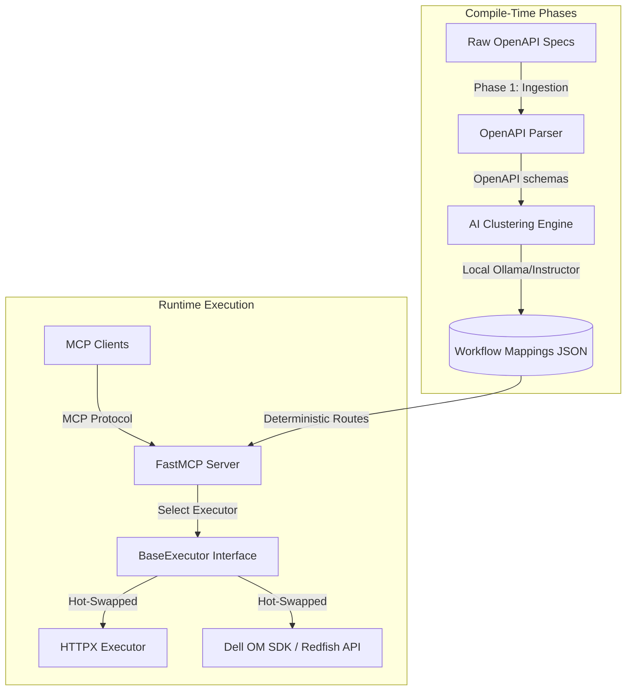

# Dell Enterprise MCP Workflow Proxy

An air-gapped, edge-native, deterministic translation layer. This system ingests 500+ raw Dell OpenAPI endpoints, clusters them into 20 high-level workflows using a local offline LLM, and executes them deterministically at runtime via FastMCP and HTTPX.

---

## 🏗️ Architecture Overview

The system design strictly separates ingest/clustering compile-time phases from the deterministic runtime translation execution:



### Core Architecture Principles

1. **Deterministic Execution**: All LLM clustering is done out-of-band during the compile/development phase. The runtime operates strictly deterministically using the pre-computed `workflow_mapping.json`.
2. **Interface Segregation**: Target-system communications are decoupled from the routing and schema translation layers, enabling clean testing and production switching.
3. **Air-gapped & Offline First**: Local parsing via `openapi-core` and offline AI clustering via `instructor` + `ollama`.

---

## 📁 Project Directory Scaffolding

```
dell_mcp_proxy/
├── data/
│   ├── raw_specs/              # Downloaded raw Dell OpenAPI YAML/JSON specs
│   └── output/                 # Generated workflow_mapping.json mapping file
├── src/
│   ├── __init__.py
│   ├── core/                   # Shared Pydantic models, configurations, and exceptions
│   │   ├── __init__.py
│   │   ├── config.py
│   │   └── exceptions.py
│   ├── parser/                 # Phase 1: OpenAPI spec parsing and schema extraction
│   │   ├── __init__.py
│   │   └── openapi_parser.py
│   ├── ai_clustering/          # Phase 2: Offline clustering via Instructor/Ollama LLM
│   │   ├── __init__.py
│   │   └── workflow_generator.py
│   └── proxy/                  # Phase 3: FastMCP Server & Deterministic Routing
│       ├── __init__.py
│       ├── server.py           # FastMCP initialization & tool registrations
│       └── executors/          # Target execution engines
│           ├── __init__.py
│           ├── base.py         # BaseExecutor Abstract Base Class
│           └── httpx_executor.py # HTTPX executor implementation
├── tests/
│   ├── __init__.py
│   └── conftest.py
├── .env.example                # Local environment template variables
├── .flake8                     # Flake8 style config
├── pyproject.toml              # Project dependencies, packaging, and tool overrides
└── README.md                   # System documentation
```

---

## 🛠️ Technical Stack & Dependencies

- **Language**: Python 3.10+
- **Dependency & Environment Manager**: `uv`
- **Core Libraries**:
  - `pydantic (V2)`: For structured data validation and modeling.
  - `fastmcp`: High-performance Python framework for Model Context Protocol servers.
  - `httpx`: Async HTTP client for mock and target communications.
  - `openapi-core`: Strict OpenAPI parsing and validation.
  - `instructor` & `ollama`: Structured local offline LLM interactions.
- **Code Quality**:
  - `black`: Strict formatting (88-char limit).
  - `flake8`: Style guide enforcement.
  - `mypy`: Strict type checking (`strict = true`).
  - `pytest`: Runtime test runner.

---

## 🚀 Getting Started & Local Setup

### 1. Prerequisites
Ensure you have Python 3.10+ and `uv` installed. If you do not have `uv`, install it via:
```bash
curl -LsSf https://astral.sh/uv/install.sh | sh
```

### 2. Environment Setup
Initialize the virtual environment and install all dependencies:
```bash
# Sync environment and lock dependencies
uv sync
```

### 3. Environment Variables
Copy the template variables file:
```bash
cp .env.example .env
```

### 4. Running & Listing Tools
Activate the virtual environment:
```bash
source .venv/bin/activate
```

List the registered workflow tools on the MCP server:
```bash
fastmcp list src/proxy/server.py
```

Run the FastMCP development console to test tools in your browser:
```bash
fastmcp dev src/proxy/server.py
```

---

## 🛡️ Code Quality & Verification Commands

All files conform to strict enterprise quality checks. Verify your changes using:

```bash
# Code Formatting (Black)
uv run black --check .

# Code Linting (Flake8)
uv run flake8 .

# Strict Type Checking (Mypy)
uv run mypy .

# Run Tests
uv run pytest
```

---

## 🔌 The Executor Contract (`BaseExecutor`)

To ensure clean hot-swapping between testing frameworks and production environments, the system abstracts execution behind `src/proxy/executors/base.py`.

```python
from abc import ABC, abstractmethod
from typing import Any, Dict

class BaseExecutor(ABC):
    @abstractmethod
    async def execute_workflow(
        self, workflow_name: str, params: Dict[str, Any]
    ) -> Dict[str, Any]:
        """
        Asynchronously execute a clustered workflow.
        """
        pass
```

- **HTTPXExecutor**: Used for mock API endpoints and REST verification during development.
- **OMSDKExecutor**: Used to swap in official Dell omsdk capabilities for hardware testing.
