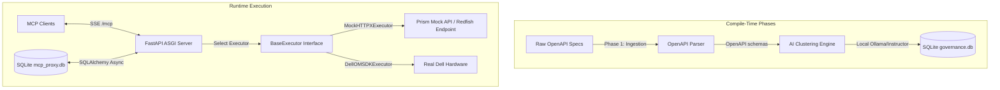

# Dell Enterprise MCP Workflow Proxy

An air-gapped, edge-native, deterministic translation layer. This system ingests 500+ raw Dell OpenAPI endpoints, clusters them into high-level workflows using a local offline LLM, and executes them deterministically at runtime via a FastAPI + FastMCP ASGI microservice backed by SQLite and SQLAlchemy.

---

## Architecture Overview

The system design separates ingest/clustering compile-time phases from the stateful runtime translation execution:



### Core Architecture Principles

1. **Stateful Persistence**: All workflows and API steps are stored in a SQLite database (`mcp_proxy.db`) using SQLAlchemy async models, replacing legacy static JSON configuration files.
2. **Governance and Approvals**: Incoming clustered workflows remain `pending` until promoted to `approved` status through admin webhook REST APIs.
3. **Dynamic Hot-Reloading**: Approved workflows are loaded dynamically as tools into FastMCP without restarting the ASGI server, and connected clients are notified in real-time.
4. **Resilience & Fault Isolation**: Asynchronous HTTP executions employ exponential backoff retries via `tenacity` specifically targeting transient network issues.

---

## Project Directory Scaffolding

```
dell_mcp_proxy/
├── data/
│   ├── raw_specs/              # Downloaded raw Dell OpenAPI YAML/JSON specs
│   └── output/                 # Runtime persistence store: mcp_proxy.db
├── src/
│   ├── __init__.py
│   ├── core/                   # Shared Pydantic models, configurations, and exceptions
│   │   ├── __init__.py
│   │   ├── config.py
│   │   ├── database.py         # SQLAlchemy schemas, engines, and async sessions
│   │   └── exceptions.py       # Custom exceptions hierarchy (e.g. DellProxyExecutionError)
│   ├── parser/                 # Phase 1: OpenAPI spec parsing and schema extraction
│   │   ├── __init__.py
│   │   └── openapi_parser.py
│   ├── ai_clustering/          # Phase 2: Offline clustering via Instructor/Ollama LLM
│   │   ├── __init__.py
│   │   └── workflow_generator.py
│   └── proxy/                  # Phase 3: FastAPI + FastMCP Server & Deterministic Routing
│       ├── __init__.py
│       ├── server.py           # FastAPI server initialization, webhooks, & dynamic tool registration
│       └── executors/          # Target execution engines
│           ├── __init__.py
│           ├── base.py         # BaseExecutor Abstract Base Class
│           └── httpx_executor.py # HTTPX executor implementation with tenacity retry loops
├── tests/
│   ├── __init__.py
│   ├── conftest.py             # Pytest fixtures and mock clients
│   ├── test_microservice.py    # Integration tests for webhooks, DB states, and reload behavior
│   └── test_mock_api.py        # HTTP mock container validation
├── .env.example                # Local environment template variables
├── .flake8                     # Flake8 style config
├── pyproject.toml              # Project dependencies, packaging, and tool overrides
└── README.md                   # System documentation
```

---

## Technical Stack & Dependencies

- **Language**: Python 3.10+
- **Dependency & Environment Manager**: `uv`
- **ASGI & Web Framework**: `fastapi` and `uvicorn`
- **MCP Framework**: `fastmcp` (using ASGI/SSE transport)
- **Database & ORM**: `sqlalchemy` (v2.0) and `aiosqlite`
- **Resilience Engine**: `tenacity` (exponential backoff & async retries)
- **Code Quality**: `black`, `flake8`, `mypy`, `pytest`

---

## Getting Started & Local Setup

### 1. Prerequisites
Ensure you have Python 3.10+ and `uv` installed. If you do not have `uv`, install it via:
```bash
curl -LsSf https://astral.sh/uv/install.sh | sh
```

*AUDIT Fix: Local LLM setup instructions*
You must also install and start the local LLM engine Ollama and pull/run the Llama3 model:
```bash
# Run Ollama with Llama3 model
ollama run llama3
```

### 2. Environment Setup
Initialize the virtual environment and install all dependencies:
```bash
# Sync environment and lock dependencies
uv sync
```

### 3. Environment Variables
Copy the template variables file:
```bash
cp .env.example .env
```

*AUDIT Fix: Document environment variables*
Ensure the following variables are defined in your `.env` file:
* `DELL_MCP_API_KEY`: The API Key used in `src/proxy/api.py` to authenticate proxy calls and administration endpoints.

---

## Running the ASGI Microservice

### 1. Start the Server
Start the Uvicorn application (which hosts both the REST endpoints and the MCP SSE interface):
```bash
uv run uvicorn src.proxy.server:app --host 0.0.0.0 --port 8000 --reload
```

### 2. REST Admin Webhooks

*   **Get Pending Workflows**:
    ```bash
    curl -X GET http://localhost:8000/workflows/pending
    ```
*   **Approve a Workflow**:
    ```bash
    curl -X POST http://localhost:8000/workflows/{id}/approve
    ```
*   **Reject a Workflow**:
    ```bash
    curl -X POST http://localhost:8000/workflows/{id}/reject
    ```
*   **Trigger Hot-Reload**: Reloads the tool list from database state and notifies connected MCP clients:
    ```bash
    curl -X POST http://localhost:8000/reload
    ```

### 3. Connect to the MCP Server
Clients can connect to the Model Context Protocol endpoint using SSE (Server-Sent Events) at:
```
http://localhost:8000/mcp
```

---

## Testing & Mock API Setup

To safely test workflows locally without breaking real hardware, we utilize a **Stoplight Prism Docker container** that mocks the realistic Dell iDRAC OpenAPI schema on port `4010`.

### 1. Start the Mock Server
Ensure Docker is running, then boot the mock API container:
```bash
docker compose up -d --build
```

### 2. Run Automated Verification Pipeline
Execute the all-in-one automation script to sync dependencies, restart the mock server, verify health, run all `pytest` suites, and check code style:
```bash
chmod +x test_all.sh
./test_all.sh
```

---

## Code Quality & Verification Commands

All files conform to strict enterprise quality checks. Verify your changes using:

```bash
# Code Formatting (Black)
uv run black --check .

# Code Linting (Flake8)
uv run flake8 .

# Strict Type Checking (Mypy)
uv run mypy .

# Run Tests
uv run pytest
```
