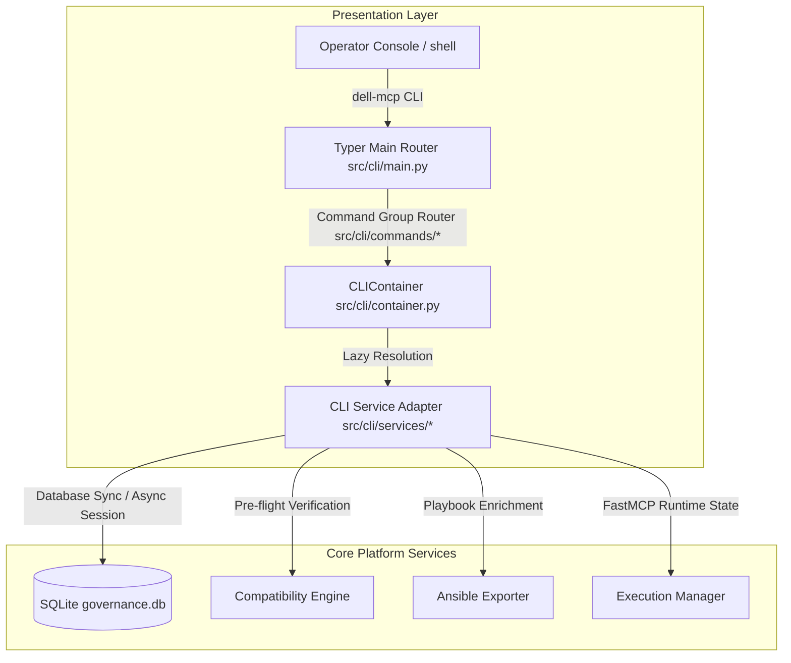

# Dell Enterprise MCP Proxy - Infrastructure Command Center CLI (`dell-mcp`)

The **Infrastructure Command Center CLI (`dell-mcp`)** is the primary operational control plane and administration utility for the Dell Enterprise MCP Proxy platform. 

It is designed for:
*   **Infrastructure Engineers** managing bare-metal systems and server topologies.
*   **Platform Reliability Engineers (PRE)** monitoring runtime states and API availability.
*   **Dell PowerEdge Administrators** validating hardware compliance and firmware inventories.
*   **Governance & Compliance Teams** auditing AI-generated workflows and reviewing action ledgers.

The CLI acts as a thin presentation and orchestration layer over the underlying Dell MCP services, presenting a high-performance, unified, and resilient command center experience.

---

## Architecture Diagram

The CLI is decoupled from the core business engines and repositories using a strict presentation layer design:



### Dependency Rules
*   Commands **must never** directly instantiate SQLite connections, SQLAlchemy sessions, HTTPX clients, or core logic engines.
*   All operations must flow through service adapters resolved via the centralized **CLIContainer**.
*   Console visual structures are decoupled from business logic.

---

## Installation & Requirements

### System Requirements
*   Python 3.10 or higher.
*   `uv` (fast Python package installer).
*   Stateful access to `data/governance.db` (seeded and active).

### Editable Development Installation
Install the project dependencies and wire the executable script locally using `uv`:
```bash
# Sync all platform virtual environment dependencies
uv sync

# Install the dell-mcp package in editable mode
uv pip install -e .
```

*Note: In default Windows environments, you can verify execution paths by running:*
```bash
$env:PYTHONIOENCODING="utf-8"
uv run python -m src.cli.main --help
```

---

## Quick Start

Quickly assess the command center and verify that database connections and service states are operational:

```bash
# Print global help instructions and subcommand catalog
dell-mcp --help

# Render the executive control plane dashboard overview
dell-mcp overview

# Verify subsystem readiness and health assessment matrix
dell-mcp health
```

---

## Command Reference

The Command Center organizes operational tasks into specialized command groups:

### 1. `cluster`
Manages AI clustering, OpenAPI integrations, and spec parsing.
*   **`summary`**
    *   *Purpose*: Render clustering metrics and distribution data.
    *   *Syntax*: `dell-mcp cluster summary`
    *   *Example Output*: Prints total endpoints, Leiden clusters, and average confidence levels.
*   **`graph`**
    *   *Purpose*: Display active relationship graphs of endpoints.
    *   *Syntax*: `dell-mcp cluster graph`
*   **`run --spec <path>`**
    *   *Purpose*: Parse an OpenAPI specification file and regenerate workflow clusters.
    *   *Syntax*: `dell-mcp cluster run --spec openapi.json`

### 2. `governance`
Enforces human-in-the-loop review cycles for LLM-generated workflows.
*   **`pending`**
    *   *Purpose*: List all workflows awaiting human approval.
    *   *Syntax*: `dell-mcp governance pending`
*   **`approved`**
    *   *Purpose*: List all certified/approved operational workflows.
    *   *Syntax*: `dell-mcp governance approved`
*   **`rejected`**
    *   *Purpose*: List workflows blocked or rejected by operators.
    *   *Syntax*: `dell-mcp governance rejected`
*   **`review <workflow_id>`**
    *   *Purpose*: Inspect a workflow's details and constituent API steps.
    *   *Syntax*: `dell-mcp governance review test_wf_1`
*   **`approve <workflow_id>`**
    *   *Purpose*: Approve a pending workflow, promoting it to an executable FastMCP tool.
    *   *Syntax*: `dell-mcp governance approve test_wf_1`
*   **`reject <workflow_id> --reason <text>`**
    *   *Purpose*: Reject a workflow and document the audit reason.
    *   *Syntax*: `dell-mcp governance reject test_wf_1 --reason "Security validation failed"`

### 3. `compatibility`
Pre-flight verification intelligence.
*   **`validate <workflow_id> --target-ip <ip>`**
    *   *Purpose*: Validate workflow steps against target hardware.
    *   *Syntax*: `dell-mcp compatibility validate test_wf_1 --target-ip 192.168.0.120`
*   **`explain <workflow_id>`**
    *   *Purpose*: Render the DAG rules tree that evaluates the workflow.
    *   *Syntax*: `dell-mcp compatibility explain test_wf_1`
*   **`dashboard <workflow_id> --target-ip <ip>`**
    *   *Purpose*: Renders the decision cockpit (see flagship section below).
    *   *Syntax*: `dell-mcp compatibility dashboard test_wf_1 --target-ip 192.168.0.120`
*   **`rules`**
    *   *Purpose*: Print the active policies and compatibility rules catalog.
    *   *Syntax*: `dell-mcp compatibility rules`
*   **`device <ip>`**
    *   *Purpose*: Query stateful cached specifications for a datacenter node.
    *   *Syntax*: `dell-mcp compatibility device 192.168.0.120`

### 4. `runtime`
Controls the FastMCP integration hooks.
*   **`tools`**
    *   *Purpose*: List currently exposed FastMCP tools ready for client consumption.
    *   *Syntax*: `dell-mcp runtime tools`
*   **`reload`**
    *   *Purpose*: Trigger hot-reloads to refresh tool mappings from database states.
    *   *Syntax*: `dell-mcp runtime reload`
*   **`execute <tool_name> --params <json>`**
    *   *Purpose*: Manually invoke a registered workflow.
    *   *Syntax*: `dell-mcp runtime execute test_workflow --params '{"sys_id": 1}'`

### 5. `ansible`
Exports workflow logic to infrastructure-as-code files.
*   **`preview <workflow_id>`**
    *   *Purpose*: Render syntax-highlighted playbook configurations directly on the console.
    *   *Syntax*: `dell-mcp ansible preview test_wf_1`
*   **`export <workflow_id> --output <path>`**
    *   *Purpose*: Export enriched playbooks directly to files.
    *   *Syntax*: `dell-mcp ansible export test_wf_1 --output playbooks/deploy.yml`

### 6. `audit`
Exposes the compliance history ledger.
*   **`events`**
    *   *Purpose*: List administrative events, modifications, and approvals.
    *   *Syntax*: `dell-mcp audit events`
*   **`executions`**
    *   *Purpose*: Print workflow runs, durations, status codes, and targets.
    *   *Syntax*: `dell-mcp audit executions`
*   **`summary`**
    *   *Purpose*: Present compliance summaries and error trends.
    *   *Syntax*: `dell-mcp audit summary`

### 7. `system`
Prints operational topology data.
*   **`topology`**
    *   *Purpose*: Display the system dependencies tree.
    *   *Syntax*: `dell-mcp system topology`

### 8. `diagnostics`
Evaluates internal health checks.
*   **`db`** / **`api`** / **`compatibility`** / **`runtime`**
    *   *Purpose*: Troubleshoot connections to database files, REST endpoints, and facts caches.
    *   *Syntax*: `dell-mcp diagnostics db`

---

## Flagship Feature: Compatibility Cockpit

The **Compatibility Cockpit** provides a single Go/No-Go verdict before executing any workflow on target hardware:

```bash
dell-mcp compatibility dashboard <workflow_id> --target-ip <ip>
```

### Cockpit Panels

1.  **Target Device**: Displays model, BIOS version, Lifecycle Controller version, and scan time.
2.  **Validation Scores**: 
    *   *Compatibility Score*: Measures compliance with active rules catalog (0-100%).
    *   *Risk Score*: Computes operational risk coefficients (0-100).
    *   *Blast Radius*: Outlines impact boundary (e.g. `NODE`, `CHASSIS`, `RACK`, `DATACENTER`).
    *   *Confidence*: Quality indicator of cached/retrieved device specifications.
3.  **Violations**: Lists check failures, expected vs actual properties, and corrective remediation actions.
4.  **Prerequisites Dependencies**: Structured tree showing parent-child dependency checks.
5.  **Final Execution Verdict**: Bold colored indicator marking either `✓ SAFE TO EXECUTE` or `✗ BLOCK EXECUTION`.

---

## Universal JSON Mode

To support scripting, automation pipeline runs, and DevOps integration, every CLI command supports the `--json` flag:

```bash
dell-mcp --json compatibility dashboard test_wf_1 --target-ip 192.168.0.120
```

When `--json` is enabled:
*   All styled panels, colors, tables, trees, and interactive spinners are **bypassed**.
*   Only valid machine-readable JSON is written to `stdout`.
*   Standard logs and non-critical warnings are redirected to `stderr`.

---

## Watch Mode

Monitor executive statuses or health assessment matrices in real-time using watch flags:

```bash
dell-mcp overview --watch --interval 2
dell-mcp health --watch
```

*   **`--watch`**: Toggles live loop.
*   **`--interval` (`-i`)**: Defines update frequency in seconds (default: 5).
*   *Exit*: Cleanly intercepts `Ctrl+C` to terminate the loops without locking SQLite files.

---

## Plugin System

The Command Center includes a self-discovering plugin mechanism located in **`src/cli/plugins/`**.

### How Plugin Discovery Works
*   The CLI scans the `src/cli/plugins/` directory at startup.
*   It dynamically loads modules that do not start with an underscore (`_`).
*   It registers subcommands if they expose a `register_plugin(app)` function or expose a `typer.Typer()` application named `app`.

### Authoring Custom Plugins
Create a Python module in `src/cli/plugins/network_config.py`:
```python
import typer

app = typer.Typer(help="Manage switch network configurations")

@app.command("show")
def show_switch_status():
    print("Switch connections operational.")
```
The CLI automatically loads this, making the command `dell-mcp network_config show` immediately available.

### Failure Isolation
If a plugin raises an exception during import or initialization:
*   The exception is caught and printed as a warning (`⚠ WARNING: Plugin load failed`).
*   The core CLI continues to boot successfully, preserving primary operations.

---

## Security Features

### Secrets Masking Shield
To ensure security, the CLI scans outputs for sensitive keys (e.g. `password`, `token`, `key`, `secret`, `authorization`, `ssn`) and masks them recursively:
*   **Console Output**: Masked with `********` inside tables and panels.
*   **JSON Mode**: Formatted structure replaces sensitive strings with `********`, preventing data leaks in automation logs.

### Access Trails
Operations that alter states (e.g. `governance approve`, `governance reject`) write audit records to the local governance ledger, documenting administrative actor and time.

---

## Troubleshooting

### Legacy Windows Output Crash (`UnicodeEncodeError`)
*   *Symptom*: Commands crash printing `UnicodeEncodeError: 'charmap' codec can't encode character...`
*   *Cause*: Legacy Windows terminal character set (e.g. CP-1252) cannot print unicode symbols (`⚠`, `✓`).
*   *Resolution*: Force the environment to use UTF-8 encoding:
    ```powershell
    $env:PYTHONIOENCODING="utf-8"
    ```

### Packaging Script Location Error (`ModuleNotFoundError`)
*   *Symptom*: Running `dell-mcp` commands raises `ModuleNotFoundError: No module named 'src'`.
*   *Cause*: Virtual environment entry point loader does not add current directory to python import list.
*   *Resolution*: Set the Python path variable or execute via the python runner module:
    ```bash
    # Setting PYTHONPATH
    $env:PYTHONPATH="."
    dell-mcp health
    
    # Or execute as module
    python -m src.cli.main health
    ```

### SQLite Database Locks
*   *Symptom*: Actions time out or fail with database locks.
*   *Cause*: Concurrent operations on SQLite files during long-running tasks.
*   *Resolution*: Run `dell-mcp diagnostics db` to check connection status. Ensure the microservice FastAPI server is running with WAL journal modes.

---

## Operator Workflows

### Workflow 1: Platform Monitoring
Verify global status and watch for changes during maintenance windows:
```bash
$env:PYTHONIOENCODING="utf-8"
dell-mcp health
dell-mcp overview --watch --interval 10
```

### Workflow 2: Safe Pre-Flight Validation & Approval
Review a workflow generated by clustering, validate it against target hardware, and approve it:
```bash
# 1. List pending LLM workflows
dell-mcp governance pending

# 2. Inspect step details
dell-mcp governance review test_wf_1

# 3. Perform pre-flight compatibility evaluation cockpit
dell-mcp compatibility dashboard test_wf_1 --target-ip 192.168.0.120

# 4. Approve workflow
dell-mcp governance approve test_wf_1
```

### Workflow 3: IaC Automation Export
Validate a workflow and export it to an enriched Ansible playbook for target datacenter node setups:
```bash
# 1. Verify compatibility
dell-mcp compatibility validate test_wf_1 --target-ip 192.168.0.120

# 2. Preview playbooks syntax
dell-mcp ansible preview test_wf_1

# 3. Export playbook to target directory
dell-mcp ansible export test_wf_1 --output playbooks/idrac_setup.yml
```
