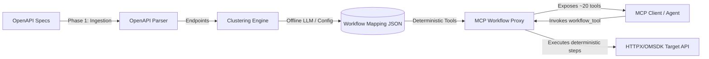

# Model Context Protocol (MCP) Workflow Proxy
## 📋 Problem Statement & Requirements Specification

> [!IMPORTANT]
> **Core Objective**: Transform complex, low-level enterprise OpenAPI specifications (500+ endpoints) into a small, cohesive set of workflow-oriented MCP tools (~20 tools) to prevent LLM context window bloat and tool-selection failures.

---

## 🔍 Context & Background

Enterprise IT infrastructures are managed through a massive array of fine-grained API endpoints:
* **Dell PowerEdge Servers** utilize the iDRAC Redfish API for hardware control, configuration, and monitoring.
* **Dell OpenManage Enterprise (OME)** exposes REST APIs for fleet-wide orchestration, compliance, and discovery.
* **Other infrastructure components** (storage switches, virtualization stacks, network elements) expose distinct API formats.

With Generative AI and agentic systems, these APIs are increasingly mapped to AI agents to enable natural language automation. The **Model Context Protocol (MCP)** acts as the communication standard to expose these integrations.

However, standard 1:1 OpenAPI-to-MCP wrappers suffer from the **Tool Explosion Problem**, exposing hundreds of tools which overwhelms the LLM's context window and hinders accurate tool selection.

---

## ❌ The Tool Explosion Problem

```mermaid
graph TD
    subgraph Raw OpenAPI Spec (100-500+ Endpoints)
        E1[GET /redfish/v1/Systems/1]
        E2[PATCH /redfish/v1/Systems/1]
        E3[POST /redfish/v1/Managers/1/Actions/Reset]
        E4[GET /redfish/v1/UpdateService/FirmwareInventory]
        E5[POST /redfish/v1/UpdateService/Actions/SimpleUpdate]
    end

    subgraph Direct OpenAPI-to-MCP Conversion (1:1)
        T1[tool: get_system_info]
        T2[tool: patch_system_info]
        T3[tool: reset_manager]
        T4[tool: get_firmware_inventory]
        T5[tool: update_firmware]
    end

    E1 --> T1
    E2 --> T2
    E3 --> T3
    E4 --> T4
    E5 --> T5

    T1 & T2 & T3 & T4 & T5 -->|Context Overload & Selection Failure| LLM[LLM Agent]
```

### Key Issues:
1. **Context Length Overload**: Presenting hundreds of tool definitions consumes a large portion of the context window (often 50,000+ tokens), degrading reasoning quality.
2. **Tool Selection Errors**: LLMs fail to pick the correct low-level API from a massive flat list of similar tools.
3. **CRUD-level Operations**: Raw endpoints are basic CRUD steps. Practical operations require composing sequences of tools (e.g., check health -> staging firmware -> applying update -> verifying reboot).
4. **Lack of Abstraction**: The LLM must manually orchestrate the sequence, increasing the chance of state errors and loop failures.

---

## 🎯 Proposed Solution: The MCP Workflow Proxy

The **MCP Workflow Proxy** sits as a deterministic translation layer between the raw OpenAPI specs and the MCP Client, exposing a consolidated interface.



---

## ⚙️ Project Scope & Boundaries

| In Scope | Out of Scope |
| :--- | :--- |
| **Parsing OpenAPI v3.x** specs (JSON/YAML) | Building a production-grade API gateway or service mesh |
| **AI-Assisted/Config-Driven Clustering** to group endpoints | Implementing end-to-end user AuthN/AuthZ (mocking/stubs allowed) |
| **Exposing dynamic workflows** via FastMCP servers | Creating a front-end client interface or custom agent chat UI |
| **Config/Mapping Override Layer** for customization | Supporting non-OpenAPI formats (GraphQL, gRPC, etc.) as core requirements |
| **Correct response propagation** & argument validation | |

---

## 📈 Success Metrics & Acceptance Criteria

> [!TIP]
> Ensure the system is optimized to meet the target thresholds before shipping a release candidate.

* **Tool Count Reduction**: **&ge; 80%** reduction in total exposed tools.
* **Context Token Reduction**: **&ge; 70%** reduction in tool definition token footprint (Target: under **~4,000 tokens**).
* **Workflow Coverage**: Covers **&ge; 80%** of standard IT operational workflows (e.g., Health, Inventory, Provisioning, Firmware).
* **Correctness**: Workflow tools must correctly validate parameters, execute multi-step requests, and aggregate results.
* **Onboarding Speed**: Parsing and clustering a new spec must execute in **under 5 minutes** (excluding manual configuration tweaks).

---

## 🛠️ Phase-by-Phase Plan

* **Phase 1: OpenAPI Ingestion**: Parse specifications using `openapi-core` and build internal route models.
* **Phase 2: Workflow Clustering**: Group routes into high-level workflows at design-time using local LLMs (`instructor` + `ollama`) and serialize them to `workflow_mapping.json`.
* **Phase 3: FastMCP Proxy Server**: Initialize the MCP server and register workflow-level tools.
* **Phase 4: Execution & Verification**: Run deterministic multi-step executions using `HTTPXExecutor` and verify correctness.

---

## 🔗 References & Standards
* **Model Context Protocol (MCP)**: [spec.modelcontextprotocol.io](https://spec.modelcontextprotocol.io)
* **FastMCP**: [gofastmcp.com](https://gofastmcp.com)
* **OpenAPI Specification**: [spec.openapis.org](https://spec.openapis.org)
